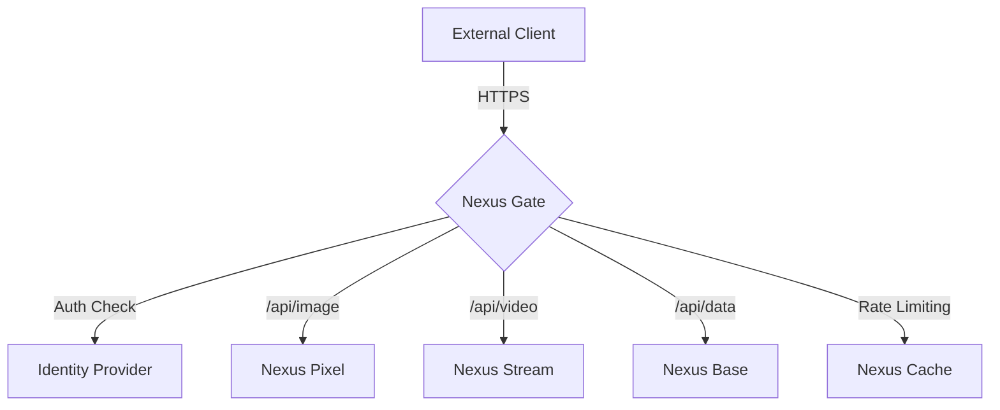

# Nexus Gate
### The Unified Interface for Your Digital World

**[🇺🇸 English](./README.md)** | [🇰🇷 한국어](./README_ko.md)

 

**Nexus Gate** is the central nervous system of the Nexus Ecosystem. It serves as the API Gateway and Orchestrator, routing requests, handling authentication/authorization, and aggregating responses from all microservices into a coherent experience.

## 🔗 System Architecture

## 🛠 Technology Stack

| Technology | Role | Justification |
| :--- | :--- | :--- |
| **Spring Cloud Gateway** | API Gateway | Built on Spring WebFlux, it handles high concurrency and provides dynamic routing. |
| **JWT (JSON Web Token)** | Security | Stateless authentication mechanism for seamless inter-service communication. |
| **Resilience4j** | Circuit Breaker | Prevents cascading failures when a downstream service is struggling. |

## 🔮 Future Roadmap
- **GraphQL Federation**: Unifying all data sources into a single graph API.
- **Service Mesh**: Transitioning to Istio or Linkerd for transparent mTLS and observability in Kubernetes.
