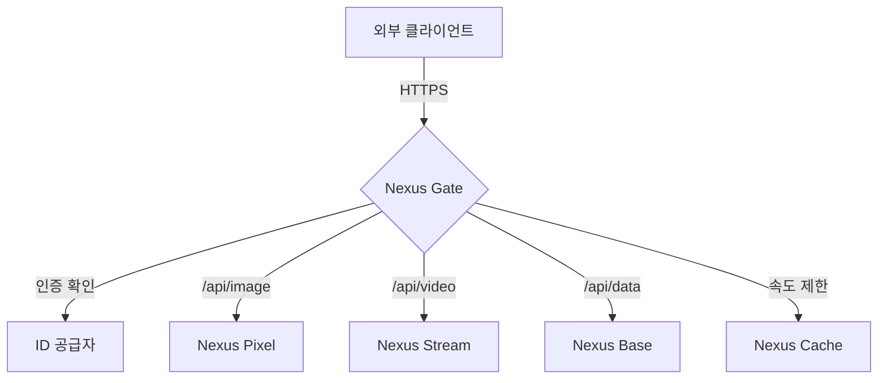

# Nexus Gate
### 당신의 디지털 세상을 위한 통합 인터페이스

[🇺🇸 English](./README.md) | **[🇰🇷 한국어](./README_ko.md)**

 

**Nexus Gate**는 Nexus 생태계의 중추 신경계입니다. API 게이트웨이 및 오케스트레이터 역할을 하며 요청을 라우팅하고, 인증/인가를 처리하고, 모든 마이크로서비스의 응답을 일관된 경험으로 통합합니다.

## 🔗 시스템 아키텍처

## 🛠 기술 스택

| 기술 | 역할 | 선정 이유 |
| :--- | :--- | :--- |
| **Spring Cloud Gateway** | API 게이트웨이 | Spring WebFlux를 기반으로 구축되어 높은 동시성을 처리하고 동적 라우팅을 제공합니다. |
| **JWT (JSON Web Token)** | 보안 | 원활한 서비스 간 통신을 위한 상태 비저장 인증 메커니즘입니다. |
| **Resilience4j** | 서킷 브레이커 | 다운스트림 서비스에 문제가 생겼을 때 연쇄적인 장애를 방지합니다. |

## 🔮 향후 로드맵
- **GraphQL Federation**: 모든 데이터 소스를 단일 그래프 API로 통합.
- **Service Mesh**: Kubernetes에서 투명한 mTLS 및 관찰 가능성을 위해 Istio 또는 Linkerd로 전환.
