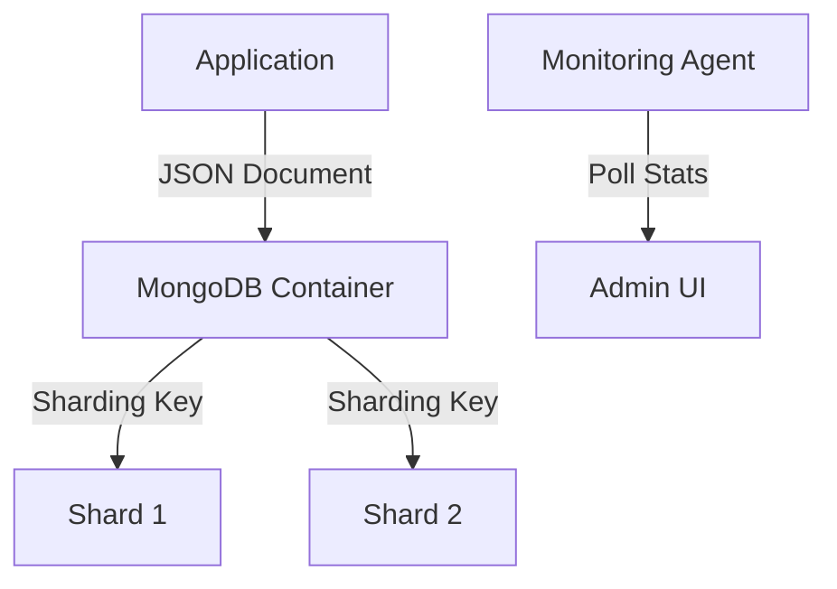

# Nexus Store
### Schema-less Document Archive for Flexibility

**[🇺🇸 English](./README.md)** | [🇰🇷 한국어](./README_ko.md)

 

**Nexus Store** is the home for unstructured and semi-structured data. Powered by **MongoDB**, it handles dynamic content like user profiles, activity logs, and polymorphic application data that doesn't fit neatly into rows and columns.

## 📦 System Architecture

## 🛠 Technology Stack

| Technology | Role | Justification |
| :--- | :--- | :--- |
| **MongoDB 6.0** | NoSQL Database | Best-in-class for handling JSON-like documents and rapid prototyping. |
| **WiredTiger** | Storage Engine | Offers excellent compression and concurrency control. |

## 🔮 Future Roadmap
- **Replica Sets**: Configuring a 3-node replica set for data redundancy and read scaling.
- **Atlas Search**: Implementing full-text search capabilities if migrating to cloud-managed Mongo.
