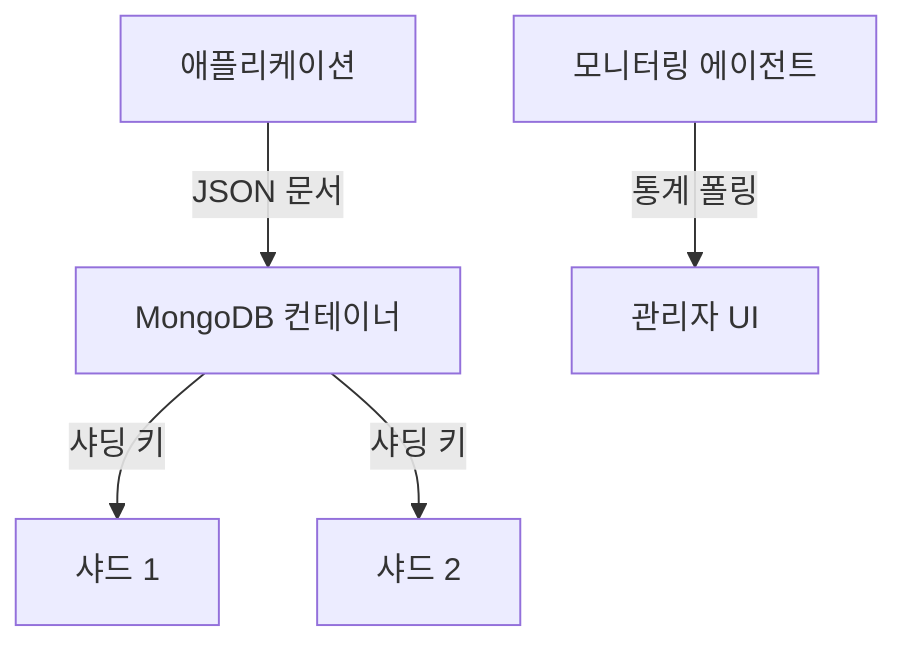

# Nexus Store
### 유연성을 위한 스키마리스 문서 저장소

[🇺🇸 English](./README.md) | **[🇰🇷 한국어](./README_ko.md)**

 

**Nexus Store**는 비정형 및 반정형 데이터의 안식처입니다. **MongoDB**로 구동되며 사용자 프로필, 활동 로그, 그리고 행과 열에 딱 들어맞지 않는 다형성 애플리케이션 데이터와 같은 동적 콘텐츠를 처리합니다.

## 📦 시스템 아키텍처

## 🛠 기술 스택

| 기술 | 역할 | 선정 이유 |
| :--- | :--- | :--- |
| **MongoDB 6.0** | NoSQL 데이터베이스 | JSON과 유사한 문서 처리 및 빠른 프로토타이핑을 위한 동급 최강의 솔루션입니다. |
| **WiredTiger** | 스토리지 엔진 | 뛰어난 압축 및 동시성 제어를 제공합니다. |

## 🔮 향후 로드맵
- **레플리카 셋**: 데이터 이중화 및 읽기 확장을 위한 3노드 레플리카 셋 구성.
- **Atlas Search**: 클라우드 관리형 Mongo로 마이그레이션 시 전문 검색(Full-text search) 기능 구현.
