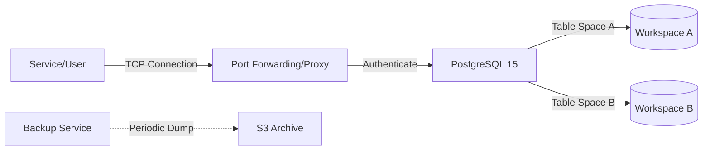

# Nexus Base
### Robust Relational Data Workspace

**[🇺🇸 English](./README.md)** | [🇰🇷 한국어](./README_ko.md)

 

**Nexus Base** offers a managed, enterprise-grade relational database experience built on **PostgreSQL 15**. It provides isolated workspaces for different applications, ensuring data integrity, complex querying capabilities, and full ACID compliance.

## 🏛 System Architecture

## 🛠 Technology Stack

| Technology | Role | Justification |
| :--- | :--- | :--- |
| **PostgreSQL 15** | RDBMS | The world's most advanced open-source database, chosen for its reliability and JSONB support. |
| **PgBouncer** | Connection Pooling | (Planned) Efficiently manages connections to prevent database saturation. |
| **Docker Volumes** | Persistence | Ensures data survives container restarts and upgrades. |

## 🔮 Future Roadmap
- **High Availability (HA)**: Implementing Patroni for automated failover.
- **DBaaS API**: An automation layer to create databases and users dynamically via REST API.
