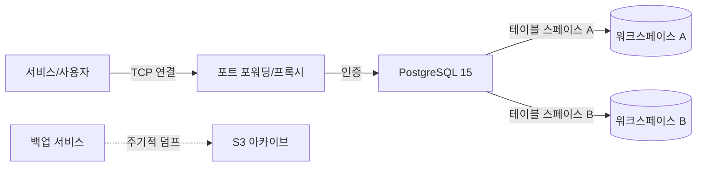

# Nexus Base
### 강력한 관계형 데이터 워크스페이스

[🇺🇸 English](./README.md) | **[🇰🇷 한국어](./README_ko.md)**

 

**Nexus Base**는 **PostgreSQL 15**를 기반으로 관리형 엔터프라이즈급 관계형 데이터베이스 경험을 제공합니다. 다양한 애플리케이션을 위한 격리된 워크스페이스를 제공하여 데이터 무결성, 복잡한 쿼리 기능 및 완전한 ACID 준수를 보장합니다.

## 🏛 시스템 아키텍처

## 🛠 기술 스택

| 기술 | 역할 | 선정 이유 |
| :--- | :--- | :--- |
| **PostgreSQL 15** | RDBMS | 신뢰성과 JSONB 지원으로 선택된 세계에서 가장 진보된 오픈 소스 데이터베이스입니다. |
| **PgBouncer** | 커넥션 풀링 | (계획됨) 데이터베이스 포화를 방지하기 위해 연결을 효율적으로 관리합니다. |
| **Docker Volumes** | 지속성 | 컨테이너 재시작 및 업그레이드 후에도 데이터가 유지되도록 보장합니다. |

## 🔮 향후 로드맵
- **고가용성 (HA)**: 자동 장애 조치를 위한 Patroni 구현.
- **DBaaS API**: REST API를 통해 데이터베이스와 사용자를 동적으로 생성하는 자동화 레이어.
